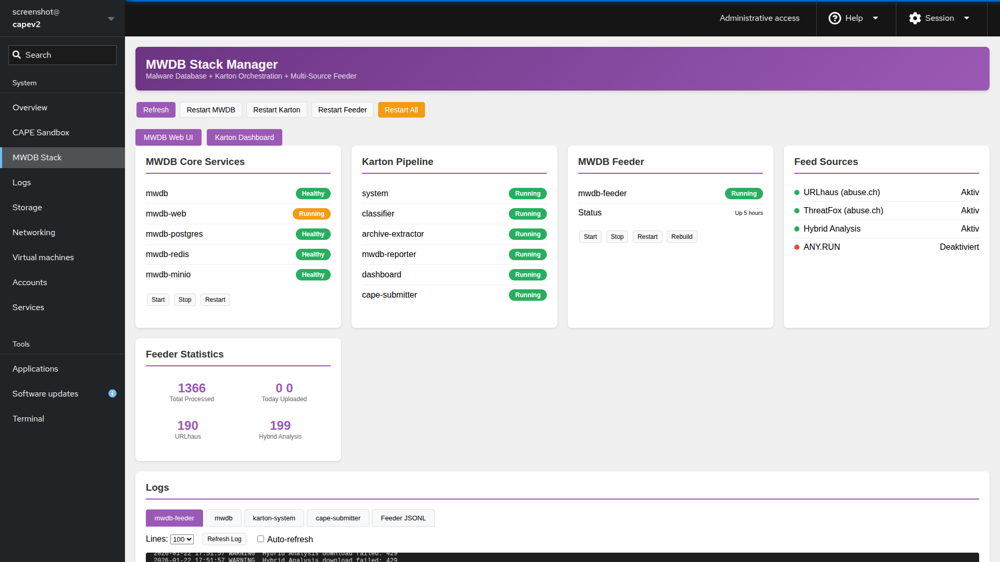
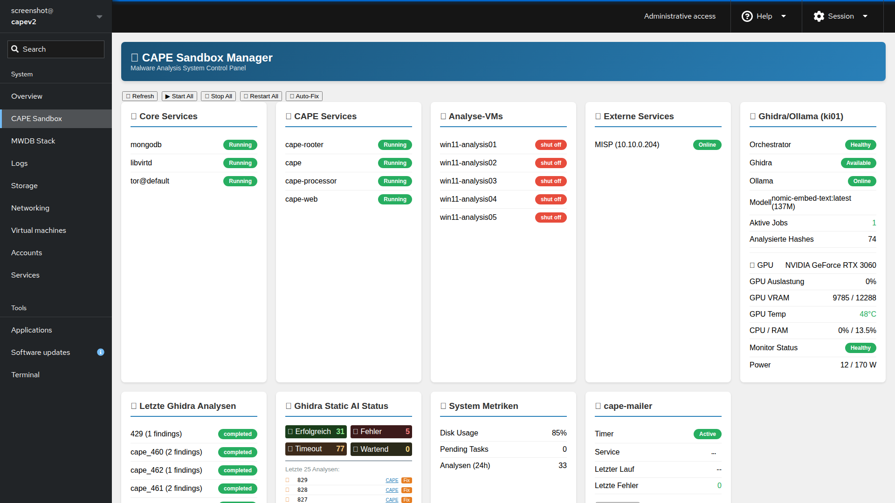

# IcePorge

**Comprehensive Malware Analysis & Threat Intelligence Stack**

IcePorge is a modular, enterprise-grade malware analysis ecosystem that integrates dynamic sandboxing, static reverse engineering, threat intelligence feeds, and LLM-powered analysis into a cohesive workflow.

[](https://opensource.org/licenses/MIT)
[](https://github.com/icepaule)

---

## Quick Start

### Clone Everything

```bash
# Clone main repository
git clone https://github.com/icepaule/IcePorge.git
cd IcePorge

# Clone all component repositories
./scripts/clone-all.sh

# For HTTPS instead of SSH:
./scripts/clone-all.sh --https
```

### Update All Repositories

```bash
# Pull latest from all repos
./scripts/clone-all.sh
```

---

## Architecture Overview

```
┌─────────────────────────────────────────────────────────────────────────────┐
│                           THREAT INTELLIGENCE FEEDS                          │
│  URLhaus ── ThreatFox ── MalwareBazaar ── Hybrid Analysis ── Ransomware.live │
└─────────────────────────────────────────────────────────────────────────────┘
                                      │
                    ┌─────────────────┴─────────────────┐
                    ▼                                   ▼
          ┌─────────────────┐                 ┌─────────────────┐
          │  MWDB-Feeder    │                 │   CAPE-Feed     │
          │  Multi-Source   │                 │  MalwareBazaar  │
          │  Aggregator     │                 │    Pipeline     │
          └────────┬────────┘                 └────────┬────────┘
                   │                                   │
                   ▼                                   ▼
┌──────────────────────────────────────────────────────────────────────────────┐
│                              ANALYSIS PLATFORM                                │
│  ┌────────────────────────────────────────────────────────────────────────┐  │
│  │                    MWDB-Stack + CAPE Sandbox                           │  │
│  │  ┌──────────┐ ┌─────────────┐ ┌──────────┐ ┌─────────────────────────┐ │  │
│  │  │  MWDB    │ │   Karton    │ │   CAPE   │ │ karton-cape-submitter  │ │  │
│  │  │  Core    │ │ Orchestrator│ │ Analysis │ │  (Automated Pipeline)  │ │  │
│  │  └──────────┘ └─────────────┘ └──────────┘ └─────────────────────────┘ │  │
│  └────────────────────────────────────────────────────────────────────────┘  │
└──────────────────────────────────────────────────────────────────────────────┘
                                      │
                                      ▼
┌──────────────────────────────────────────────────────────────────────────────┐
│                           AI-ENHANCED ANALYSIS (ki01)                         │
│  ┌──────────────────────────────┐    ┌──────────────────────────────────┐   │
│  │    Ghidra-Orchestrator      │    │       Malware-RAG                │   │
│  │  • Headless Decompilation   │    │  • Vector Database (Qdrant)     │   │
│  │  • LLM Code Understanding   │    │  • FOR610 Knowledge Base        │   │
│  │  • Ollama Integration       │    │  • Context-Aware Analysis       │   │
│  └──────────────────────────────┘    └──────────────────────────────────┘   │
└──────────────────────────────────────────────────────────────────────────────┘
                                      │
                                      ▼
                       ┌──────────────────────────┐
                       │          MISP            │
                       │  Threat Intelligence     │
                       └──────────────────────────┘
```

---

## Components

| Repository | Description | Server |
|------------|-------------|--------|
| [IcePorge-MWDB-Stack](https://github.com/icepaule/IcePorge-MWDB-Stack) | MWDB-core with Karton orchestration | capev2 |
| [IcePorge-MWDB-Feeder](https://github.com/icepaule/IcePorge-MWDB-Feeder) | Multi-source malware aggregator | capev2 |
| [IcePorge-CAPE-Feed](https://github.com/icepaule/IcePorge-CAPE-Feed) | MalwareBazaar → CAPE → MISP pipeline | capev2 |
| [IcePorge-CAPE-Mailer](https://github.com/icepaule/IcePorge-CAPE-Mailer) | Email-triggered analysis | capev2 |
| [IcePorge-Cockpit](https://github.com/icepaule/IcePorge-Cockpit) | Web management UI (Cockpit modules) | capev2 |
| [IcePorge-Ghidra-Orchestrator](https://github.com/icepaule/IcePorge-Ghidra-Orchestrator) | Automated reverse engineering | ki01 |
| [IcePorge-Malware-RAG](https://github.com/icepaule/IcePorge-Malware-RAG) | LLM-powered RAG analysis | ki01 |

---

## Features

### Threat Intelligence Ingestion
- **URLhaus** - Malicious URL and payload collection
- **ThreatFox** - IOC aggregation with sample downloads
- **MalwareBazaar** - Malware sample repository
- **Hybrid Analysis** - Falcon Sandbox public feed
- **Ransomware.live** - Ransomware gang tracking

### Dynamic Analysis
- **CAPE Sandbox** - Behavior analysis with config extraction
- **Automated submission** - Tag-based routing and prefiltering
- **MISP integration** - Automatic IOC export

### Static Analysis
- **Ghidra Headless** - Automated decompilation
- **LLM Enhancement** - AI-powered code understanding
- **API Extraction** - Function and string analysis

### AI-Enhanced Analysis
- **Ollama Integration** - Local LLM inference (privacy-focused)
- **RAG Pipeline** - Context-aware malware analysis
- **Vector Search** - Semantic similarity with Qdrant

---

## Configuration

All sensitive data (API keys, passwords) is stored in `.env` files which are **never committed**.

### Required API Keys

| Service | Registration | Used By |
|---------|--------------|---------|
| abuse.ch | https://auth.abuse.ch/ | MWDB-Feeder, CAPE-Feed |
| Hybrid Analysis | https://www.hybrid-analysis.com/signup | MWDB-Feeder |
| MISP | Your instance | CAPE-Feed |

---

## Automatic Sync

The `sync-to-github.sh` script automatically synchronizes local changes:

```bash
# Manual sync with dry-run
/opt/iceporge/sync-to-github.sh --dry-run --verbose

# Sync with screenshot capture
/opt/iceporge/sync-to-github.sh --screenshots

# Add to crontab (daily at 2:00 AM)
0 2 * * * /opt/iceporge/sync-to-github.sh >> /var/log/iceporge-sync.log 2>&1
```

Features:
- **Sensitive data detection** - Blocks commits with passwords/keys
- **Screenshot capture** - Documents web interfaces
- **Multi-server support** - Works on capev2 and ki01

---

## Management UI

Access via Cockpit at `https://your-server:9090/`:
- **CAPE Sandbox** - Service status, VM management
- **MWDB Stack** - Container status, Karton pipeline

---

## Screenshots

### MWDB Web Interface


*Central malware sample repository with tagging, relationships, and Karton integration.*

### MWDB Stack Manager (Cockpit)


*Manage MWDB services, Karton pipeline, and container health from Cockpit.*

### CAPE Sandbox Manager (Cockpit)


*Monitor CAPE services, VMs, and external service connectivity.*

---

## License

MIT License with Attribution

**Author:** Michael Pauli
- GitHub: [@icepaule](https://github.com/icepaule)
- Email: info@mpauli.de

When using this software, please maintain attribution to the original author.

---

## Contributing

Contributions welcome! Please:
1. Fork the relevant component repository
2. Create a feature branch
3. Submit a pull request

## Support

- Open an issue in the relevant repository
- Email: info@mpauli.de
