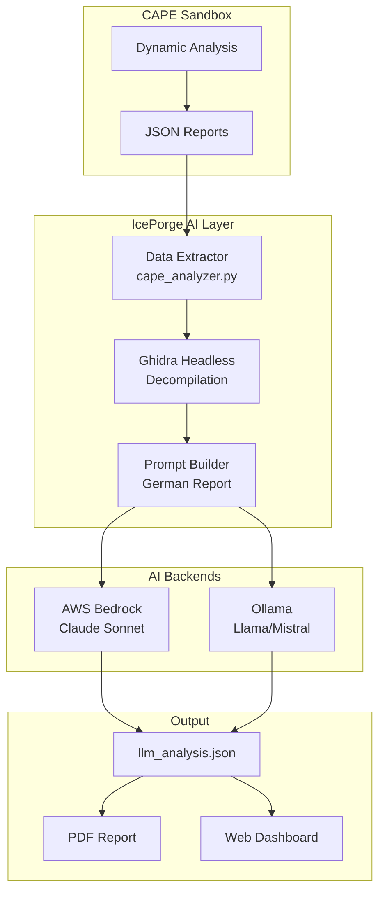

# CAPE AI-Enhanced Analysis System

IcePorge extends CAPEv2 malware sandbox with AI-powered static and dynamic analysis using AWS Bedrock (Claude) or local Ollama models.

## Architecture



## Components

### 1. Data Extraction (`cape_analyzer.py`)

Extracts structured data from CAPE's `lite.json` and `report.json`:

```python
data = {
    'filename': 'malware.exe',
    'sha256': '69b69e...',
    'file_type': 'PE32 executable',
    'malscore': 8.5,
    'signatures': [...],
    'network': {...},
    'pe': {
        'machine': 'IMAGE_FILE_MACHINE_I386',
        'imphash': 'abc123...',
        'sections': ['.text (entropy: 6.6)', '.rdata (entropy: 5.5)'],
    },
    'processes': [...],
    'behavior': {...},
    'ghidra': {...}  # If Ghidra analysis completed
}
```

**Key Data Sources:**

| CAPE Report | IcePorge Field | Description |
|-------------|----------------|-------------|
| `target.file.pe.machine_type` | `pe.machine` | CPU architecture (x86/x64) |
| `target.file.pe.imphash` | `pe.imphash` | Import hash for clustering |
| `target.file.pe.sections[].entropy` | `pe.sections` | Section entropy (packing detection) |
| `signatures[]` | `signatures` | Behavioral indicators |
| `network.dns[]` | `network.dns` | DNS queries |
| `behavior.summary` | `behavior` | File/Registry operations |

### 2. Ghidra Integration

Automated headless decompilation for static analysis:

```python
# cape_analyzer.py line ~577
def _run_ghidra_analysis(binary: Path, data: dict) -> dict:
    cmd = [
        ghidra_headless,
        temp_project_dir,
        "TempProject",
        "-import", str(binary),
        "-postScript", "FunctionCallGraphScript.java",
        "-scriptPath", scripts_dir,
        "-max-cpu", str(cpu_count),
        "-analysisTimeoutPerFile", "600"
    ]
    result = subprocess.run(
        cmd, capture_output=True, text=True, timeout=600
    )
```

**Output:**
- Function list with addresses
- Decompiled code snippets
- String references
- Call graph relationships

**Timeout Settings:**
- Subprocess: 600s (10 minutes)
- Per-file analysis: 600s
- Gunicorn worker: 900s (15 minutes)

### 3. AI Prompt Generation

Builds comprehensive German analysis prompts:

```python
def build_analysis_prompt(data: dict) -> str:
    prompt = f"""
    # Malware-Analyse: {data['filename']}
    
    ## Datei-Metadaten
    - SHA256: {data['sha256']}
    - Typ: {data['file_type']}
    - Größe: {data['file_size']} Bytes
    - CAPE Malscore: {data['malscore']}/10
    
    ## PE-Header
    - Architektur: {data['pe']['machine']}
    - Import Hash: {data['pe']['imphash']}
    - Sections: {', '.join(data['pe']['sections'])}
    
    ## Verhaltens-Signaturen (Severity 3 = High)
    {format_signatures(data['signatures'])}
    
    ## Netzwerk-Aktivität
    {format_network(data['network'])}
    
    ## Ghidra Statische Analyse
    {format_ghidra(data['ghidra'])}
    
    Analysiere diese Malware und erstelle einen deutschen Bericht mit:
    1. Executive Summary
    2. Technische Analyse
    3. MITRE ATT&CK Mapping
    4. IOCs
    5. Empfehlungen
    """
```

### 4. AI Backends

#### AWS Bedrock (Production)

```python
# webapp/app.py
llm_provider = LLMProviderFactory.create(
    provider='bedrock',
    model_id='eu.anthropic.claude-sonnet-4-6',
    region='eu-central-1',
    max_tokens=16000
)
```

**Configuration:** `/etc/systemd/system/iceporge-web.service`
```ini
Environment=AI_BACKEND=bedrock
Environment=AWS_REGION=eu-central-1
Environment=BEDROCK_MODEL_ID=eu.anthropic.claude-sonnet-4-6
Environment=BEDROCK_MAX_TOKENS=16000
```

#### Ollama (On-Premise)

```python
llm_provider = LLMProviderFactory.create(
    provider='ollama',
    model_id='llama3.1:70b',
    api_url='http://10.10.0.210:11434'
)
```

**Configuration:**
```ini
Environment=AI_BACKEND=ollama
Environment=OLLAMA_API_URL=http://10.10.0.210:11434
Environment=OLLAMA_MODEL_ID=llama3.1:70b
```

### 5. Analysis Caching

Results are cached to avoid redundant AI calls:

```python
# webapp/app.py
llm_cache_file = analysis_dir / 'reports' / 'llm_analysis.json'

if not refresh and llm_cache_file.exists():
    cached = json.load(open(llm_cache_file))
    cached['cached'] = True
    return jsonify(cached)

# Otherwise, run fresh analysis
result = analyze_cape_report(str(analysis_dir), llm_provider, filename_hint)

# Save to cache
with open(llm_cache_file, 'w') as f:
    json.dump(result, f, indent=2)
```

**Cache Invalidation:**
- Manual: `?refresh=1` query parameter
- Automatic: Delete `llm_analysis.json` to force re-analysis

## API Endpoints

### Get AI Analysis

```http
GET /cape/<analysis_id>/llm
```

**Response:**
```json
{
  "analysis_id": 6219,
  "analysis": "# Malware-Analyse...",
  "data": {
    "filename": "vdbXMLSignature.exe",
    "sha256": "69b69efe...",
    "pe": {
      "machine": "IMAGE_FILE_MACHINE_I386",
      "sections": [".text (entropy: 6.6)", ...]
    },
    "ghidra": {
      "status": "success",
      "functions": 1234,
      "strings": 567
    }
  },
  "cached": false,
  "generated_at": "2026-08-07T08:32:27"
}
```

### Force Refresh

```http
GET /cape/<analysis_id>/llm?refresh=1
```

### Generate PDF Report

```http
GET /cape/<analysis_id>/pdf
```

Downloads a PDF with:
- Executive summary
- Technical details
- IOC table
- Recommendations

## Performance Optimization

### Ghidra Parallelization

```python
# Use all CPU cores minus 2
cpu_count = max(1, os.cpu_count() - 2)
cmd = [..., "-max-cpu", str(cpu_count)]
```

### Selective Analysis

Skip Ghidra for known-benign files:

```python
result = extract_cape_data(
    report_dir, 
    skip_ghidra=True  # Only dynamic analysis
)
```

### Timeout Configuration

| Component | Timeout | Reason |
|-----------|---------|--------|
| Ghidra subprocess | 600s | Complex decompilation |
| Gunicorn worker | 900s | AI analysis + Ghidra |
| AWS Bedrock API | 120s | Model inference |

## Troubleshooting

See [TROUBLESHOOTING.md](TROUBLESHOOTING.md) for:
- NULL PE data fixes
- Entropy parse errors
- Worker timeout issues
- Python cache problems

## Example Analysis Output

### Executive Summary

```markdown
# Malware-Analyse: vdbXMLSignature.exe

**Verdict:** Wahrscheinlich Benign (Malscore: 1.0/10)

Diese 32-Bit Windows PE-Datei ist eine legitime digitale Signatur-Bibliothek 
des deutschen Software-Herstellers VDB Solutions. Keine verdächtigen 
Verhaltensweisen erkannt.
```

### Technical Details

```markdown
## PE-Header Analyse

- **Architektur:** IMAGE_FILE_MACHINE_I386 (32-bit)
- **Import Hash:** c3a2b1...
- **Sections:**
  - .text (entropy: 6.6) - Compressed/packed code
  - .rdata (entropy: 5.5) - Read-only data
  - .data (entropy: 5.1) - Initialized data

## Ghidra Reverse Engineering

**Funktionen:** 1,234 identified
**Strings:** 567 extracted

Wichtige API-Calls:
- CryptSignHash (Digitale Signatur-Erzeugung)
- XMLDocumentLoad (XML-Verarbeitung)
```

## Configuration Reference

### Environment Variables

| Variable | Example | Description |
|----------|---------|-------------|
| `AI_BACKEND` | `bedrock` | AI provider (bedrock/ollama/both) |
| `AWS_REGION` | `eu-central-1` | AWS region for Bedrock |
| `BEDROCK_MODEL_ID` | `eu.anthropic.claude-sonnet-4-6` | Claude model |
| `BEDROCK_MAX_TOKENS` | `16000` | Max response length |
| `OLLAMA_API_URL` | `http://10.10.0.210:11434` | Ollama server |
| `OLLAMA_MODEL_ID` | `llama3.1:70b` | Ollama model |
| `CAPE_API_KEY` | `8020e0d5...` | CAPE API authentication |

### File Locations

| Path | Description |
|------|-------------|
| `/opt/iceporge/ai/cape_analyzer.py` | Main analysis logic |
| `/opt/iceporge/webapp/app.py` | Flask web API |
| `/opt/CAPEv2/storage/analyses/<ID>/reports/` | CAPE output |
| `/opt/CAPEv2/storage/analyses/<ID>/reports/llm_analysis.json` | AI analysis cache |
| `/var/log/iceporge/access.log` | HTTP access log |
| `/var/log/iceporge/error.log` | Error log |

## Development

### Testing Locally

```bash
cd /opt/iceporge

python3 << 'EOF'
import sys
sys.path.insert(0, '/opt/iceporge/ai')
from cape_analyzer import extract_cape_data

# Test without Ghidra (fast)
result = extract_cape_data('/opt/CAPEv2/storage/analyses/6219', skip_ghidra=True)
print(result['pe']['machine'])  # Should show: IMAGE_FILE_MACHINE_I386
EOF
```

### Adding New Data Fields

1. Extract from CAPE JSON in `extract_cape_data()`
2. Add to prompt in `build_analysis_prompt()`
3. Update `data` dict schema
4. Clear cache: `rm -rf /opt/iceporge/ai/__pycache__/`
5. Restart: `systemctl restart iceporge-web.service`

## References

- [CAPE Documentation](https://capev2.readthedocs.io/)
- [Ghidra Headless](https://ghidra-sre.org/)
- [AWS Bedrock](https://aws.amazon.com/bedrock/)
- [Ollama](https://ollama.ai/)
