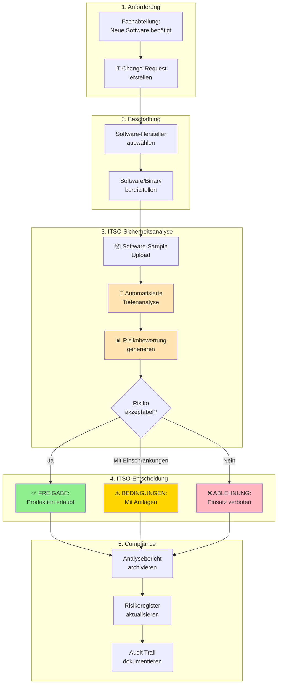
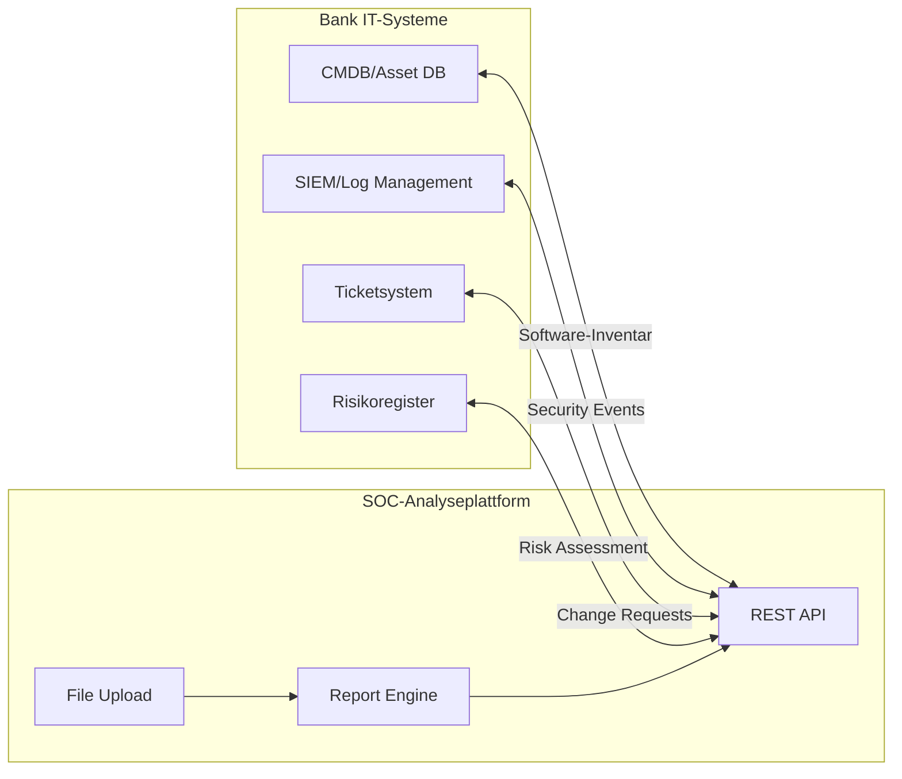

# Leistungsbeschreibung: Automatisierte Software-Risikoanalyse für Banken

**Dokumenttyp:** Leistungsbeschreibung für SOC-Dienstleister  
**Zielgruppe:** Regulierte Finanzinstitute (Banken, Sparkassen)  
**Anwendungsfall:** Software-Einführungsprozess / Change Management  
**Version:** 1.0  
**Stand:** 2026-08-07

---

## 1. Ausgangslage und Zielsetzung

### 1.1 Regulatorische Anforderungen

Banken unterliegen strengen regulatorischen Vorgaben bezüglich IT-Sicherheit:

- **BAIT** (Bankaufsichtliche Anforderungen an die IT)
- **MaRisk** (Mindestanforderungen an das Risikomanagement)
- **DORA** (Digital Operational Resilience Act)
- **KRITIS** (Kritische Infrastrukturen - BSI-Gesetz §8a)

Diese Vorschriften fordern:
✅ Risikoanalyse **vor** Produktivsetzung neuer Software  
✅ Dokumentation von Sicherheitsbewertungen  
✅ Technische Due Diligence bei Software-Einführung  
✅ Nachweis von Security-Testing-Prozessen

### 1.2 Geschäftsprozess: Software-Einführung



### 1.3 Abgrenzung: Nicht Malware-Analyse, sondern Risikobewertung

**Ziel ist NICHT:**
- ❌ Erkennung von Schadsoftware in E-Mails
- ❌ Forensik bei Security-Incidents
- ❌ Malware-Familie-Klassifizierung

**Ziel ist:**
- ✅ Technische Risikobewertung **legitimer** Business-Software
- ✅ Identifikation von Sicherheitslücken (z.B. veraltete Bibliotheken)
- ✅ Erkennung problematischer Verhaltensmuster (z.B. unverschlüsselte Datenübertragung)
- ✅ Compliance-Prüfung (z.B. Datenschutz, Netzwerk-Isolation)

---

## 2. Erforderliche Analysefunktionen

### 2.1 Statische Code-Analyse

#### 2.1.1 PE-Header und Metadaten-Extraktion

**Zweck:** Identifikation von Software-Herkunft und Build-Qualität

**Zu extrahierende Daten:**

| Attribut | Bedeutung für Risikobewertung |
|----------|------------------------------|
| **Digitale Signatur** | Verifikation des Herstellers, Nachweis der Integrität |
| **Zertifikatskette** | Validierung des Code-Signing-Zertifikats |
| **Timestamp** | Erkennung von Build-Datum-Anomalien (z.B. Backdating) |
| **PE-Architektur** | x86/x64 - Kompatibilität mit Banksystemen |
| **Import Hash (Imphash)** | Identifikation bekannter Software-Versionen |
| **Sektions-Entropy** | Erkennung von Packern/Obfuscation (Hinweis auf verdeckte Funktionen) |
| **PDB-Pfad** | Entwicklungsumgebung-Informationen |
| **Version Resource** | Produkt-/Dateiversion, Copyright-Informationen |

**Regulatorischer Nutzen:**
- **BAIT Tz. 91-93:** Verifikation der Software-Herkunft
- **MaRisk AT 7.2:** Risikobewertung technischer Komponenten

#### 2.1.2 Eingebettete Dateien und Komponenten (Binwalk)

**Zweck:** Identifikation versteckter Komponenten und Abhängigkeiten

**Zu identifizierende Elemente:**

| Element | Risiko-Relevanz |
|---------|----------------|
| **Embedded Certificates** | SSL/TLS-Zertifikate → Prüfung auf Gültigkeit |
| **XML/Config-Dateien** | Konfigurationsparameter → Hardcoded Credentials? |
| **Archive (ZIP, RAR)** | Zusätzliche Dateien → Hidden Payloads? |
| **Verschlüsselte Bereiche** | Unbekannte verschlüsselte Daten → Backdoor? |
| **Andere Executables** | Dropper-Verhalten → Ungenehmigter Code-Download? |

**Prüfkriterien:**
- ✅ Sind embedded certificates gültig und vertrauenswürdig?
- ✅ Enthält Software versteckte ausführbare Komponenten?
- ✅ Gibt es verschlüsselte Datenblöcke ohne dokumentierten Zweck?

**Regulatorischer Nutzen:**
- **BAIT Tz. 47:** Schutz vor unbefugter Software-Installation
- **BSI C5:** Prüfung auf undeklarierte Funktionen

#### 2.1.3 Abhängigkeiten und Libraries

**Zweck:** Identifikation veralteter/verwundbarer Komponenten

**Zu extrahierende Informationen:**

```
Import Address Table (IAT)
├─ Verwendete DLLs (z.B. MSVCRT, WS2_32, CRYPT32)
├─ Importierte API-Funktionen
└─ Link-Time-Abhängigkeiten
```

**Kritische API-Calls (Red Flags):**

| API-Call | Bedeutung | Risiko-Einschätzung |
|----------|-----------|---------------------|
| `CreateRemoteThread` | Code-Injection | ⚠️ Hoch (außer bei Debugging-Tools) |
| `URLDownloadToFile` | Code-Download | ⚠️ Hoch (potentielle Command & Control) |
| `CryptEncrypt` | Verschlüsselung | ℹ️ Mittel (legitim für Business-Software) |
| `RegSetValueEx` | Registry-Schreibzugriff | ℹ️ Mittel (Persistenz-Mechanismus) |
| `WNetAddConnection` | Netzwerk-Shares | ℹ️ Mittel (Data Exfiltration-Risiko) |

**Regulatorischer Nutzen:**
- **DORA Art. 8:** Risikobewertung von Drittanbieter-Software
- **MaRisk AT 7.2:** Bewertung technischer Abhängigkeiten

### 2.2 Dynamische Verhaltensanalyse (Sandbox)

#### 2.2.1 Netzwerk-Verhalten

**Zweck:** Identifikation unerwünschter Kommunikation

**Zu protokollierende Aktivitäten:**

| Aktivität | Prüfkriterium | Risikobewertung |
|-----------|---------------|-----------------|
| **DNS-Anfragen** | Ziel-Domains bekannt/dokumentiert? | Unbekannte Domains = ⚠️ |
| **TCP-Verbindungen** | IP-Adressen/Ports genehmigt? | Port 443 (HTTPS) = ℹ️, Port 4444 = ⚠️ |
| **HTTP/HTTPS-Requests** | TLS-verschlüsselt? Self-signed Certs? | Unverschlüsselt = ⚠️ |
| **Übertragene Daten** | Sensitive Informationen (Credentials, PII)? | Plaintext-Übertragung = ❌ |

**Banken-spezifische Prüfungen:**
1. **SWIFT/SEPA-Endpoints:** Kommuniziert Software mit Zahlungsverkehrs-Systemen?
2. **Cloud-Services:** Werden Daten an Public Cloud (AWS, Azure, GCP) gesendet?
3. **Geolocation:** Verbindungen zu Ländern außerhalb EU/EWR?

**Regulatorischer Nutzen:**
- **DSGVO Art. 32:** Verschlüsselung personenbezogener Daten
- **BAIT Tz. 53:** Netzwerksegmentierung und -kontrolle
- **Zahlungsdiensteaufsichtsgesetz (ZAG):** Sichere Zahlungsverkehrsabwicklung

#### 2.2.2 Dateisystem-Zugriffe

**Zweck:** Erkennung unautorisierten Datenzugriffs

**Zu überwachende Operationen:**

| Operation | Kritische Pfade | Risiko |
|-----------|-----------------|--------|
| **Lese-Zugriffe** | `%APPDATA%`, `%USERPROFILE%`, Registry-Hives | ℹ️ Normal |
| **Schreib-Zugriffe** | `C:\Windows\System32`, `HKLM\SOFTWARE` | ⚠️ Systemmodifikation |
| **Neue Dateien** | `.exe`, `.dll`, `.bat`, `.ps1` in TEMP | ⚠️ Dropper-Verhalten |
| **Gelöschte Dateien** | Log-Dateien, Security-Event-Logs | ❌ Evidence Tampering |

**Banken-spezifische Dateipfade:**

```
Hochsensible Verzeichnisse (Banking):
├─ Zahlungsverkehr: /swift/messages, /sepa/transfers
├─ Kunden-Daten: /crm/exports, /kyc/documents  
├─ Finanz-Daten: /accounting/ledger, /reporting/bafin
└─ Backup-Pfade: /backup, /snapshots
```

**Prüfung:** Greift Software auf diese Pfade zu, obwohl nicht erforderlich?

**Regulatorischer Nutzen:**
- **BAIT Tz. 45:** Datenzugriffskontrollen
- **MaRisk AT 7.2:** Integritätssicherung von Daten

#### 2.2.3 Persistenz-Mechanismen

**Zweck:** Identifikation unerwünschter Autostart-Funktionen

**Zu detektierende Mechanismen:**

| Mechanismus | Pfad/Location | Bewertung |
|-------------|---------------|-----------|
| **Registry Run-Keys** | `HKLM\SOFTWARE\Microsoft\Windows\CurrentVersion\Run` | ⚠️ Bei Geschäftssoftware OK, aber dokumentationspflichtig |
| **Windows Services** | Neue Dienste mit LocalSystem-Rechten | ⚠️ Hohe Privilegien = erhöhtes Risiko |
| **Scheduled Tasks** | Task Scheduler Library | ℹ️ Normal für Maintenance-Software |
| **WMI Event Subscriptions** | `root\subscription` | ❌ Unüblich, potentiell versteckte Persistenz |

**Prüfkriterium:** Ist Autostart-Verhalten **dokumentiert** und **erforderlich**?

**Regulatorischer Nutzen:**
- **BAIT Tz. 91:** Change Management - ungenehmigte Systemänderungen

### 2.3 KI-gestützte Risikoanalyse

#### 2.3.1 Automatisierte Bewertung

**Zweck:** Zusammenfassung der Risiken für ITSO-Entscheider

**Erforderliche AI-Analyse:**

1. **Executive Summary** (Management-Level)
   - Bedrohungsstufe: HARMLOS / NIEDRIG / MITTEL / HOCH / KRITISCH
   - 2-3 Sätze Zusammenfassung
   - Empfehlung: FREIGABE / AUFLAGEN / ABLEHNUNG

2. **Technische Detailanalyse** (Analyst-Level)
   - Funktionsweise der Software (Zweck, Mechanismen)
   - Identifizierte Sicherheitsrisiken mit CVSS-Score
   - Compliance-Bewertung (DSGVO, BAIT, MaRisk)
   - MITRE ATT&CK-Mapping (relevante Techniken)

3. **Empfohlene Schutzmaßnahmen**
   - Netzwerk-Firewall-Regeln
   - Erforderliche Berechtigungen (Least Privilege)
   - Monitoring-Anforderungen
   - Zeitliche Befristung der Freigabe

#### 2.3.2 Regulatorische Einordnung

**AI muss beantworten:**

| Frage | Regulatorischer Bezug |
|-------|----------------------|
| Verwendet Software verschlüsselte Kommunikation? | **DSGVO Art. 32** |
| Werden personenbezogene Daten verarbeitet? | **DSGVO Art. 4** |
| Erfolgen Verbindungen zu Drittländern? | **DSGVO Art. 44-50** |
| Sind Logging-Funktionen vorhanden? | **BAIT Tz. 64-66** |
| Ist ein Notfall-Abschaltmechanismus vorhanden? | **DORA Art. 11** |

---

## 3. Technische Anforderungen an die Analyseumgebung

### 3.1 Isolierte Sandbox

**Sicherheitsanforderungen:**

| Anforderung | Spezifikation | Begründung |
|-------------|---------------|------------|
| **Netzwerk-Isolation** | Kein direkter Internet-Zugang, nur über kontrolliertes Egress-Gateway | Verhindert Command & Control-Kommunikation |
| **VM-basiert** | Einweg-VMs, nach Analyse gelöscht | Verhindert Cross-Contamination |
| **Snapshot-Technologie** | Clean-State-Wiederherstellung < 60 Sekunden | Ermöglicht parallele Analysen |
| **Monitoring** | Vollständige Netzwerk-/Prozess-/Dateisystem-Telemetrie | Lückenlose Aufzeichnung |

**Bank-spezifische Anforderungen:**
- ✅ Sandbox **innerhalb** des Bank-Netzwerks (nicht Cloud)
- ✅ Zugriff nur für autorisierte ITSO-Mitarbeiter
- ✅ Audit-Logs aller Analyse-Zugriffe (Wer? Wann? Welche Software?)

### 3.2 Statische Analyse-Tools

**Erforderliche Fähigkeiten:**

| Tool-Kategorie | Funktion | Beispiel-Tools |
|----------------|----------|----------------|
| **Disassembler** | Decompilation zu lesbarem Code | Ghidra, IDA Pro, Radare2 |
| **PE-Parser** | Header/Metadaten-Extraktion | PEFile, CFF Explorer |
| **Firmware-Analyse** | Embedded Files, Entropy | Binwalk, Binvis.io |
| **Dependency-Scanner** | DLL-Imports, API-Calls | Dependency Walker, PE Explorer |

**Anforderung:** Headless-Betrieb (automatisierbar, keine GUI)

### 3.3 Berichtsformat

**Ausgabeformate:**

1. **Structured JSON** (Maschinell verarbeitbar)
   - Für Integration in SIEM/SOAR
   - Für Risikoregister-Import
   - Für Compliance-Dashboards

2. **PDF-Bericht** (Human-readable)
   - Executive Summary (1 Seite)
   - Technischer Anhang (10-20 Seiten)
   - Compliance-Checkliste
   - IOC-Liste (Indicators of Compromise)

3. **STIX/TAXII-Export** (Threat Intelligence)
   - Für Austausch mit anderen Banken
   - Für BaFin-Meldungen (bei kritischen Vorfällen)

---

## 4. Qualitätsanforderungen

### 4.1 Analysedauer

| Dateigröße | Max. Analysedauer | SLA |
|------------|-------------------|-----|
| < 10 MB | 15 Minuten | 95% |
| 10-100 MB | 30 Minuten | 90% |
| > 100 MB | 60 Minuten | 80% |

**Kritische Anforderung:** Ergebnis **innerhalb eines Arbeitstages** (8 Stunden)

### 4.2 False Positive Rate

**Akzeptanz-Schwellwerte:**

- **False Positives** (legitime Software als Risiko markiert): < 10%
- **False Negatives** (Risiken übersehen): < 1%

**Kalibrierung:** Quartalweise Review anhand Real-World-Samples

### 4.3 Verfügbarkeit

**SLA-Anforderungen:**

| Metrik | Zielwert | Messung |
|--------|----------|---------|
| **Uptime** | 99.5% | Monatlich |
| **Response Time** | < 2 Sekunden | Upload → Analyse-Start |
| **Support** | 8/5 (Geschäftszeiten) | Reaktionszeit < 4h |

---

## 5. Datenschutz und Compliance

### 5.1 Datenverarbeitung

**Zu analysierende Dateien können enthalten:**
- Personenbezogene Daten (z.B. in Config-Dateien, Logs)
- Geschäftsgeheimnisse
- Bankinterne Informationen

**Anforderungen:**

| Anforderung | Spezifikation |
|-------------|---------------|
| **Datenstandort** | EU/EWR (DSGVO Art. 44) |
| **Verschlüsselung** | AES-256 (at rest), TLS 1.3 (in transit) |
| **Aufbewahrung** | Max. 90 Tage, dann automatische Löschung |
| **Zugriffskontrolle** | RBAC, MFA für alle Zugriffe |
| **Audit-Trail** | Vollständige Protokollierung |

### 5.2 Auftragsverarbeitung (AVV)

**SOC-Dienstleister agiert als Auftragsverarbeiter i.S.d. DSGVO Art. 28**

Erforderlich:
- ✅ Schriftlicher Auftragsverarbeitungsvertrag
- ✅ Technisch-organisatorische Maßnahmen (TOMs)
- ✅ Sub-Auftragsverarbeiter-Genehmigung
- ✅ Unterstützung bei DSFA (Datenschutz-Folgenabschätzung)

### 5.3 BaFin-Anforderungen

**BAIT-Konformität:**

| BAIT-Anforderung | Umsetzung |
|------------------|-----------|
| **Tz. 47:** Schadprogramm-Schutz | Sandbox isoliert potentiell schädliche Software |
| **Tz. 64:** Protokollierung | Vollständige Analyse-Logs für min. 6 Monate |
| **Tz. 91:** Change Management | Risikoanalyse VOR Produktivsetzung |
| **Tz. 93:** Patch Management | Identifikation veralteter Bibliotheken |

---

## 6. Preismodell und SLA

### 6.1 Abrechnungsmodell

**Option A: Pay-per-Analysis**
- Pro analysierte Datei (gestaffelt nach Größe)
- Vorteil: Keine Fixkosten
- Nachteil: Schwer kalkulierbar

**Option B: Flatrate**
- Monatspauschale für unbegrenzte Analysen
- Vorteil: Planbare Kosten
- Nachteil: Höhere Grundkosten

**Empfehlung für Banken:** Flatrate (budgetsicher, MaRisk-konform)

### 6.2 Service Level Agreement

**Kritische SLA-Parameter:**

| Parameter | Zielwert | Vertragsstrafe bei Unterschreitung |
|-----------|----------|-----------------------------------|
| **Availability** | 99.5% | 10% der Monatsgebühr pro 0.1% |
| **Analysis Duration** | 95% < 30 min | 5% der Monatsgebühr pro 5% |
| **False Positive Rate** | < 10% | Nachbesserungspflicht |
| **Support Response** | < 4h | 2% der Monatsgebühr pro Tag |

---

## 7. Integration in Bank-IT-Landschaft

### 7.1 Schnittstellen

**Erforderliche APIs:**



**API-Anforderungen:**
- REST API mit OAuth 2.0 / Client Credentials
- Rate Limiting: Min. 100 Requests/Minute
- Bulk-Upload: Max. 100 Dateien parallel
- Webhook-Callbacks bei Analyse-Fertigstellung

### 7.2 SSO-Integration

**Anforderung:** Integration in Bank-IAM

- SAML 2.0 oder OpenID Connect
- Unterstützung für Azure AD / On-Prem AD
- Gruppenbasierte Berechtigungen
- Audit-Log aller Zugriffe

---

## 8. Auditierung und Zertifizierung

### 8.1 Erforderliche Nachweise

**SOC-Dienstleister muss vorhalten:**

| Nachweis | Zweck |
|----------|-------|
| **ISO 27001** | Informationssicherheits-Management |
| **SOC 2 Type II** | Security, Availability, Confidentiality |
| **BSI C5** | Cloud Computing Compliance Criteria Catalogue |
| **TISAX** (optional) | Automotive-Branche (falls relevant) |

### 8.2 Audit-Rechte der Bank

**Vertragliche Regelungen:**

- ✅ Jährliches Audit-Recht vor Ort
- ✅ Ad-hoc-Audits bei kritischen Vorfällen
- ✅ Zugang zu SOC 2-Berichten
- ✅ Einsicht in Sicherheitsvorfälle (Incident Reports)

---

## 9. Exit-Strategie

### 9.1 Vertragsauflösung

**Anforderungen bei Vertragsende:**

| Anforderung | Frist |
|-------------|-------|
| Datenrückgabe (alle Analyseberichte) | 30 Tage |
| Löschnachweis (DSGVO Art. 17) | 60 Tage |
| Dokumentation (Prozesse, Playbooks) | 90 Tage |
| Wissenstransfer (Schulung) | 90 Tage |

### 9.2 Business Continuity

**Absicherung gegen Dienstleister-Ausfall:**

- Escrow-Vereinbarung für kritische Dokumentation
- Alternativ-Dienstleister vorqualifiziert
- Interne Failover-Lösung für Notfälle

---

## 10. Anhang: Checkliste für Ausschreibung

### 10.1 Pflichtkriterien (K.O.-Kriterien)

- [ ] ISO 27001-Zertifizierung vorhanden
- [ ] Datenverarbeitung ausschließlich in EU/EWR
- [ ] DSGVO-konformer Auftragsverarbeitungsvertrag
- [ ] Verfügbarkeit 99.5% mit SLA-Garantie
- [ ] Referenzen aus regulierter Finanzbranche
- [ ] Analysedauer < 30 Minuten (95%-Quantil)
- [ ] Deutscher Support (Geschäftszeiten)

### 10.2 Bewertungskriterien (Punktevergabe)

| Kriterium | Max. Punkte |
|-----------|-------------|
| **Preis** | 30 |
| **False Positive Rate** (historisch nachgewiesen) | 20 |
| **Referenzen (Anzahl Banken)** | 15 |
| **Zusatzfeatures** (z.B. Threat Intelligence Feed) | 10 |
| **Reaktionszeit Support** | 10 |
| **Zertifizierungen** (zusätzlich zu ISO 27001) | 10 |
| **Integration** (vorhandene Schnittstellen) | 5 |

**Mindestpunktzahl:** 60/100

---

## Ansprechpartner und Kontakt

**Für Rückfragen zur Leistungsbeschreibung:**

- **ITSO (IT-Sicherheitsorganisation)**
- Anforderungen an: [Ihre interne Kontaktadresse]

**Ausschreibungs-Timeline:**

| Phase | Dauer |
|-------|-------|
| Angebotsphase | 6 Wochen |
| Bewertung | 3 Wochen |
| Vertragsverhandlung | 4 Wochen |
| PoC (Proof of Concept) | 6 Wochen |
| Rollout | 8 Wochen |

**Gesamtdauer:** Ca. 6 Monate bis Go-Live

---

**Dokumentversion:** 1.0  
**Datum:** 2026-08-07  
**Status:** Zur Verwendung für Dienstleister-Ausschreibung freigegeben
