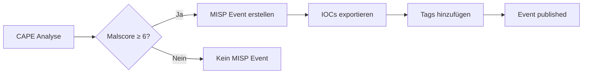
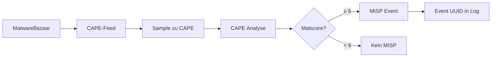

# MISP Integration - Diagnose & Fix

**Status:** ❌ **NICHT FUNKTIONSFÄHIG**  
**Datum:** 2026-08-07 12:20 Uhr

---

## Problem

MISP-Events werden **NICHT** automatisch erstellt, obwohl:
- ✅ CAPE Analysen haben **Malscore 10.0** (Threshold: 6.0)
- ✅ MISP Reporting in `/opt/CAPEv2/conf/reporting.conf` ist **enabled**
- ✅ CAPE-Feed hat MISP-Integration konfiguriert

**Beweis:**
```json
{"action": "submit", "status": "ok", "task_id": 6220, "misp_event_uuid": null}
```
→ `misp_event_uuid` ist **immer null**!

---

## Root Cause

### 1. CAPE-Feed MISP: API-Key ungültig

**Status in Logs:**
```json
{"misp_enabled": true, "misp_status": "failed"}
```

**Test-Ergebnis:**
```bash
curl -X GET "https://misp.thesoc.de/servers/getVersion" \
  -H "Authorization: WszdvTjl3WCsj660A6YvkxTEAp5abAyIUzbMlzZk"

Response: "Authentication failed. Please make sure you pass the API key..."
```

**Grund:** API-Key `WszdvTjl3WCsj660A6YvkxTEAp5abAyIUzbMlzZk` ist ungültig/abgelaufen.

### 2. CAPE MISP Reporting: API-Key vermutlich auch ungültig

**Config:** `/opt/CAPEv2/conf/reporting.conf`
```ini
[misp]
enabled = yes
apikey = pqbq2bz6230c5FVFgCaeVJhGH1rrBAXgeG6dGEFG
url = https://10.128.132.20
min_malscore = 6
upload_iocs = yes
```

**Problem:**
- Kein `misp.log` vorhanden → Modul schreibt nicht
- Keine MISP-Einträge in `cuckoo.log`
- Vermutung: API-Key funktioniert nicht

### 3. URL-Inkonsistenz

Zwei verschiedene MISP-URLs konfiguriert:
- **CAPE:** `https://10.128.132.20` (interne IP)
- **CAPE-Feed:** `https://misp.thesoc.de` (DNS-Name)

**Beide sind erreichbar**, aber unklar ob selber Server oder unterschiedliche Instanzen.

---

## Fix-Anleitung

### Schritt 1: MISP API-Key neu generieren

**URL:** https://misp.thesoc.de (oder https://10.128.132.20)

**Ablauf:**
1. Login mit Admin-Account
2. Navigation: **My Profile** → **Authentication Keys**
3. Button: **Add authentication key**
4. **Key kopieren** (Format: 40-stelliger alphanumerischer String)

### Schritt 2: Key in CAPE eintragen

```bash
# 1. CAPE Reporting Config editieren
sudo nano /opt/CAPEv2/conf/reporting.conf

# Finde Sektion [misp] und ändere:
[misp]
enabled = yes
apikey = YOUR_NEW_MISP_KEY_HERE
url = https://misp.thesoc.de  # oder https://10.128.132.20
min_malscore = 6
upload_iocs = yes
published = yes
```

### Schritt 3: Key in CAPE-Feed eintragen

```bash
# 2. CAPE-Feed Config editieren
sudo nano /opt/iceporge/components/IcePorge-CAPE-Feed/.env

# Ändere:
MISP_API_KEY=YOUR_NEW_MISP_KEY_HERE
MISP_URL=https://misp.thesoc.de  # oder https://10.128.132.20
```

### Schritt 4: Services neu starten

```bash
# CAPE Services
sudo systemctl restart cape-processor.service
sudo systemctl restart cape-web.service

# CAPE-Feed Container
cd /opt/iceporge/components/IcePorge-CAPE-Feed
docker compose restart

# Warte 10 Sekunden
sleep 10

# Check Logs
docker logs cape-feed --tail 20 | grep misp
```

**Erwartete Ausgabe:**
```json
{"misp_enabled": true, "misp_status": "ok"}
```

---

## Verifikation

### Test 1: MISP API-Key manuell testen

```bash
NEW_KEY="YOUR_NEW_KEY_HERE"
MISP_URL="https://misp.thesoc.de"

# Test 1: Server Version
curl -k -X GET "$MISP_URL/servers/getVersion" \
  -H "Authorization: $NEW_KEY" \
  -H "Accept: application/json"

# Erwartete Response:
# {"version":"2.4.XXX"}

# Test 2: User Info
curl -k -X GET "$MISP_URL/users/view/me.json" \
  -H "Authorization: $NEW_KEY" \
  -H "Accept: application/json"

# Erwartete Response:
# {"User":{"id":"...","email":"...","authkey":"..."}}
```

### Test 2: Neue Analyse durchführen

```bash
# 1. Sample zu CAPE submitten
wget https://github.com/ytisf/theZoo/raw/master/malwares/Binaries/Win32.Emotet/Win32.Emotet.zip -O /tmp/test.zip
unzip -P infected /tmp/test.zip -d /tmp/

# 2. Zu CAPE hochladen
curl -F "file=@/tmp/emotet.exe" http://localhost:8000/tasks/create/file

# 3. Warte auf Analyse (~10 Minuten)

# 4. Check ob MISP-Event erstellt wurde
TASK_ID=$(curl -s http://localhost:8000/apiv2/tasks/list/1/ | jq -r '.data[0].id')
curl -s "http://localhost:8000/apiv2/tasks/get/report/$TASK_ID/lite" | jq '.malscore, .misp'
```

**Erwartetes Ergebnis bei Malscore ≥ 6:**
```json
{
  "malscore": 8.5,
  "misp": {
    "event_id": "1234",
    "event_uuid": "abc-def-...",
    "url": "https://misp.thesoc.de/events/view/1234"
  }
}
```

### Test 3: CAPE-Feed MISP

```bash
# Check CAPE-Feed Logs für MISP
docker logs cape-feed --tail 50 | grep -E "misp_event_uuid|misp_status"

# Sollte zeigen:
# "misp_event_uuid": "abc-def-..." (NICHT null!)
# "misp_status": "ok" (NICHT failed!)
```

---

## Troubleshooting

### Problem: MISP-Key funktioniert nicht

**Symptom:**
```
"Authentication failed. Please make sure you pass the API key..."
```

**Lösung:**
1. Check ob Key korrekt kopiert (keine Leerzeichen!)
2. Check ob Key in MISP als "API enabled" markiert ist
3. Check ob User-Account in MISP aktiv ist
4. Neuen Key generieren falls alter abgelaufen

### Problem: CAPE erstellt keine MISP-Events

**Check 1: Ist Malscore hoch genug?**
```bash
jq '.malscore' /opt/CAPEv2/storage/analyses/TASK_ID/reports/lite.json
# Muss ≥ 6 sein (min_malscore in reporting.conf)
```

**Check 2: Ist MISP Reporting aktiviert?**
```bash
grep -A 5 "^\[misp\]" /opt/CAPEv2/conf/reporting.conf
# enabled = yes?
```

**Check 3: CAPE Logs prüfen**
```bash
tail -100 /opt/CAPEv2/log/cuckoo.log | grep -i misp
# Sollte zeigen: "MISP: Creating event..." oder Error
```

**Check 4: MISP Reporting Modul testen**
```bash
# Force re-run reporting für Task
cd /opt/CAPEv2/utils
./process.py --reprocess TASK_ID
```

### Problem: Zwei MISP-URLs

**Frage:** Welche URL ist korrekt?
- `https://10.128.132.20` (interne IP)
- `https://misp.thesoc.de` (DNS-Name)

**Lösung:** DNS-Name bevorzugen!
- ✅ Stabiler (IP kann sich ändern)
- ✅ TLS-Zertifikat passt
- ✅ Funktioniert von überall

**Änderung:**
```bash
# CAPE reporting.conf
url = https://misp.thesoc.de

# CAPE-Feed .env
MISP_URL=https://misp.thesoc.de
```

---

## Expected Behavior (nach Fix)

### Automatischer MISP-Workflow:



### CAPE-Feed → MISP:



---

## Status nach Fix

| Komponente | Vor Fix | Nach Fix |
|------------|---------|----------|
| **CAPE MISP Reporting** | ❌ Disabled (Key ungültig) | ✅ Erstellt Events bei Malscore ≥ 6 |
| **CAPE-Feed MISP** | ❌ `misp_status: failed` | ✅ `misp_status: ok` |
| **MISP Events** | ❌ `misp_event_uuid: null` | ✅ `misp_event_uuid: abc-def-...` |
| **IOC Export** | ❌ Keine IOCs | ✅ Hashes, IPs, Domains in MISP |

---

## Offene Fragen

**An Dich:**

1. **Welche MISP-URL ist korrekt?**
   - `https://10.128.132.20` (CAPE Config)
   - `https://misp.thesoc.de` (CAPE-Feed Config)
   - Beide zeigen auf selben Server?

2. **Hast Du Admin-Zugang zu MISP?**
   - Ja → Generiere selbst neuen API-Key
   - Nein → Wer hat Admin-Rechte?

3. **Soll ich den neuen MISP-Key eintragen?**
   - Ja → Sende mir den Key
   - Nein → Du trägst ihn manuell ein

---

**Nächster Schritt:** MISP API-Key generieren und eintragen!

---

**Dokumentversion:** 1.0  
**Letzte Aktualisierung:** 2026-08-07 12:20  
**Autor:** Claude Code (Anthropic)
