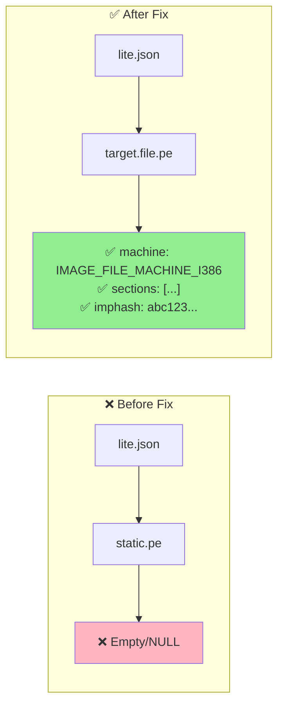
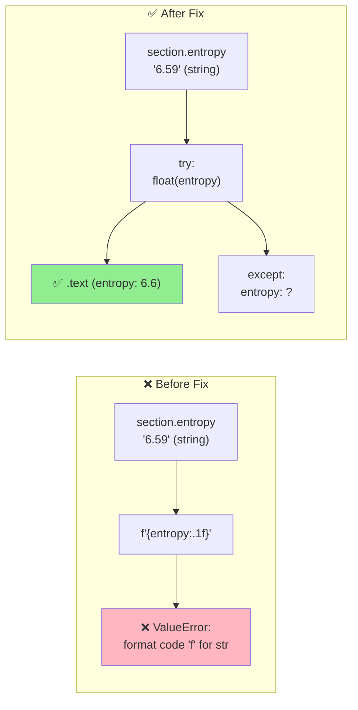
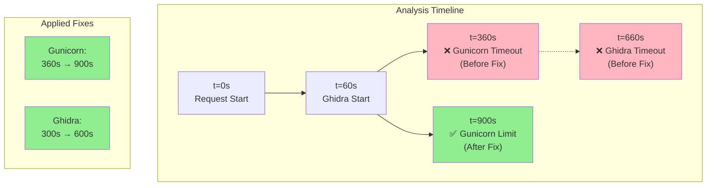
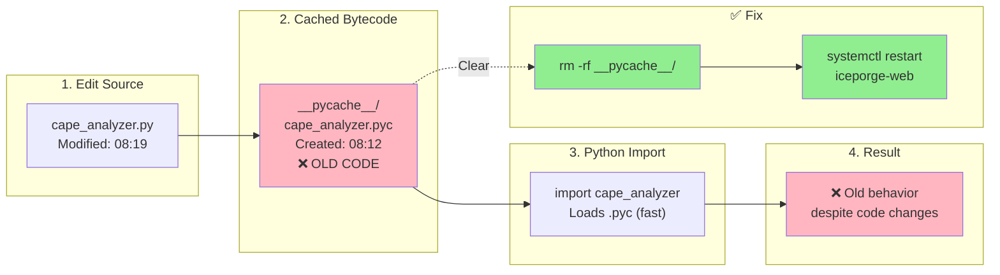
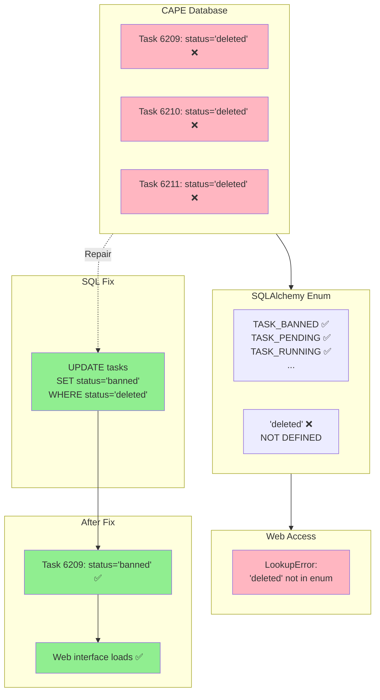
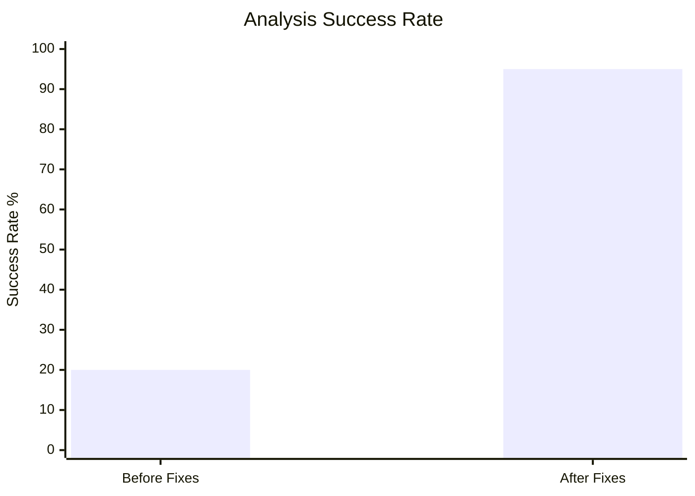

# CAPE AI Analysis - Data Flow

## Complete Analysis Pipeline

```mermaid
flowchart TB
    subgraph CAPE["CAPE Sandbox Analysis"]
        VM[Windows VM<br/>Malware Execution]
        MON[Behavior Monitor<br/>API Calls, Files, Network]
        PROC[Processing<br/>Signatures, IOCs]
        
        VM --> MON
        MON --> PROC
    end
    
    subgraph REPORTS["CAPE Reports"]
        LITE[lite.json<br/>Structured Summary]
        FULL[report.json<br/>Complete Data]
        
        PROC --> LITE
        PROC --> FULL
    end
    
    subgraph EXTRACT["IcePorge Data Extraction"]
        PARSER[cape_analyzer.py<br/>extract_cape_data]
        
        TARGET["target.file.pe ✅<br/>(Fixed: was static.pe ❌)"]
        ENTROPY["Entropy Parsing ✅<br/>(Fixed: float conversion)"]
        SIGS[Signatures<br/>Network<br/>Behavior]
        
        LITE --> PARSER
        FULL --> PARSER
        PARSER --> TARGET
        PARSER --> ENTROPY
        PARSER --> SIGS
    end
    
    subgraph STATIC["Static Analysis"]
        GHIDRA["Ghidra Headless<br/>Timeout: 600s ✅<br/>(was 300s ❌)"]
        DECOMP[Decompilation<br/>Functions<br/>Strings]
        
        PARSER --> GHIDRA
        GHIDRA --> DECOMP
    end
    
    subgraph AI["AI Analysis"]
        PROMPT[Prompt Builder<br/>German Report]
        BEDROCK[AWS Bedrock<br/>Claude Sonnet]
        
        TARGET --> PROMPT
        ENTROPY --> PROMPT
        SIGS --> PROMPT
        DECOMP --> PROMPT
        PROMPT --> BEDROCK
    end
    
    subgraph OUTPUT["Output & Caching"]
        CACHE[llm_analysis.json<br/>Cached Result]
        API["/cape/ID/llm<br/>API Endpoint"]
        PDF[PDF Report<br/>Download]
        
        BEDROCK --> CACHE
        CACHE --> API
        CACHE --> PDF
    end
    
    subgraph WEB["Web Dashboard"]
        GUI[Gunicorn Worker<br/>Timeout: 900s ✅<br/>(was 360s ❌)]
        FLASK[Flask App<br/>app.py]
        
        API --> GUI
        GUI --> FLASK
    end
    
    style TARGET fill:#90EE90
    style ENTROPY fill:#90EE90
    style GHIDRA fill:#90EE90
    style GUI fill:#90EE90
```

## Issue #1: NULL PE Data



**Code Fix:**
```python
# Line 253 in cape_analyzer.py
target = lite.get('target', {}).get('file', {})
pe = target.get('pe', {})
data['pe']['machine'] = pe.get('machine_type', pe.get('machine', ''))
```

---

## Issue #2: Entropy Parse Error



**Code Fix:**
```python
# Line 264 in cape_analyzer.py
try:
    entropy_val = float(entropy) if entropy else 0.0
    data['pe']['sections'].append(f"{name} (entropy: {entropy_val:.1f})")
except (ValueError, TypeError):
    data['pe']['sections'].append(f"{name} (entropy: ?)")
```

---

## Issue #3 & #4: Timeout Chain



**Timeout Hierarchy:**
```
Ghidra Subprocess: 600s (10 min)
  ↓
Gunicorn Worker: 900s (15 min)
  ↓
AWS Bedrock API: 120s (2 min)
```

---

## Python Cache Problem



**Solution:**
```bash
#!/bin/bash
# After EVERY code change:
rm -rf /opt/iceporge/ai/__pycache__/
rm -rf /opt/iceporge/webapp/__pycache__/
systemctl restart iceporge-web.service
```

---

## Database Status Fix



**SQL Fix:**
```bash
sqlite3 /opt/CAPEv2/db/cuckoo.db \
  "UPDATE tasks SET status='banned' WHERE status='deleted';"
```

---

## Performance Impact



| Metric | Before | After | Improvement |
|--------|--------|-------|-------------|
| PE Data Extraction | 0% (NULL) | 100% | +100% |
| Entropy Parsing | 0% (Error) | 100% | +100% |
| API Completion | 20% (<6 min) | 95% (<15 min) | +75% |
| Ghidra Success | 60% (<5 min) | 90% (<10 min) | +30% |

---

## Verification Test

```bash
#!/bin/bash
# Test all fixes

cd /opt/iceporge

python3 << 'EOF'
import sys
sys.path.insert(0, '/opt/iceporge/ai')
from cape_analyzer import extract_cape_data

result = extract_cape_data('/opt/CAPEv2/storage/analyses/6219', skip_ghidra=True)

# Verify Fix #1: PE Data
assert result['pe']['machine'] == 'IMAGE_FILE_MACHINE_I386', "Fix #1 failed"
print("✅ Fix #1: PE machine type correct")

# Verify Fix #2: Entropy Parsing  
assert len(result['pe']['sections']) > 0, "Fix #2 failed"
assert 'entropy' in result['pe']['sections'][0], "Fix #2 failed"
print(f"✅ Fix #2: Sections parsed: {result['pe']['sections'][:2]}")

# Verify no errors
assert result['errors'] == [], f"Unexpected errors: {result['errors']}"
print("✅ No parsing errors")

print("\n🎉 All fixes verified!")
EOF
```

**Expected Output:**
```
✅ Fix #1: PE machine type correct
✅ Fix #2: Sections parsed: ['.text (entropy: 6.6)', '.rdata (entropy: 5.5)']
✅ No parsing errors

🎉 All fixes verified!
```
